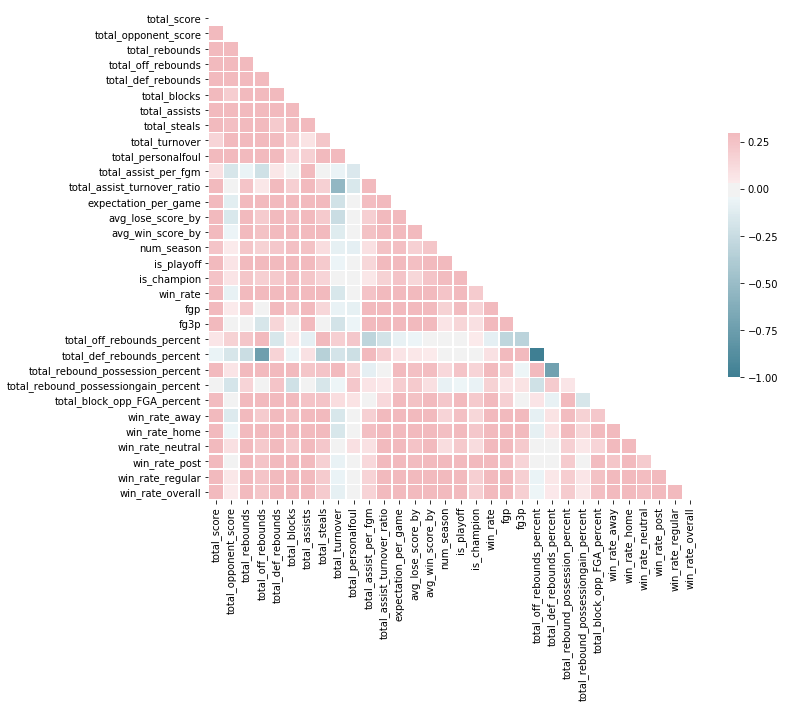

___
this notebook select features that are important before throwing into the model


```python
%matplotlib inline
import pandas as pd
import numpy as np
from sklearn.feature_selection import *
from sklearn import *
from scipy import *
from statsmodels.stats.outliers_influence import variance_inflation_factor
from sklearn.decomposition import PCA
from sklearn.feature_selection import RFE, SelectFromModel
from sklearn.linear_model import LogisticRegression, LassoCV
from sklearn.ensemble import RandomForestRegressor, RandomForestClassifier, ExtraTreesClassifier
from sklearn.grid_search import GridSearchCV

import matplotlib.pyplot as plt
import seaborn as sns

from aggregate_function import build_features_table, combine_features_table, coach_stats, win_rate_type_of_location
```


```python
coach_file = 'data/DataFiles/TeamCoaches.csv'
regularseason_file = 'data/DataFiles/RegularSeasonDetailedResults.csv'
postseason_file = 'data/DataFiles/NCAATourneyCompactResults.csv'
```


```python
initial_features = build_features_table.BuildFeaturesTable(regularseason_file)
win_rate_features = win_rate_type_of_location.WinRateTypeLocation(regularseason_file)
coach_features = coach_stats.CoachStats(coach_file,regularseason_file,postseason_file)

features = combine_features_table.CombineFeaturesTable(initial_features,win_rate_features,coach_features)
```

## Feature Selection on Correlation Matrix
- remove features that are highly correlated


```python
features_table = (
    features.final_table_processed
    .drop(['Season','TeamID'],1)
)

corr = features_table.corr()
# features_table.corr(method='pearson').to_csv("correlation_matrix.csv")
```

columns to be excluded
- total score
- total rebounds
- total blocks
- total assist turnover ratio
- E(X) per game
- win rate
- total rebound possession per game
- win_rate_overall coach


```python
mask = np.zeros_like(corr, dtype=np.bool)
mask[np.triu_indices_from(mask)] = True

# Set up the matplotlib figure
f, ax = plt.subplots(figsize=(11, 9))

# Generate a custom diverging colormap
cmap = sns.diverging_palette(220, 10, as_cmap=True)

# Draw the heatmap with the mask and correct aspect ratio
sns.heatmap(corr, mask=mask, cmap=cmap, vmax=.3, center=0,
            square=True, linewidths=.5, cbar_kws={"shrink": .5})
```


    <matplotlib.axes._subplots.AxesSubplot at 0x10b4ac668>





```python
features_table = (
    features.final_table_processed
    .drop(['Season','TeamID','total_score','total_rebounds','total_blocks','total_assist_turnover_ratio','expectation_per_game',
           'win_rate','total_rebound_possession_percent','win_rate_overall','total_off_rebounds_percent','total_def_rebounds_percent'
          ],1)
    .fillna(0)
)
```

## Feature selection from collinearity
- remove features that are collinearity
- features are then passed through variance threshold before passing into models for feature selection


```python
vif = pd.DataFrame()
vif['VIF_factor'] = [variance_inflation_factor(features_table.values, i) for i in range(features_table.shape[1])]
vif['features'] = features_table.columns
```

features to further remove
- total_opponent_score
- total_rebound_possessiongain_percent 
- fg3p


```python
features_table = (
    features.final_table_processed
    .drop(['Season','TeamID','total_score','total_rebounds','total_blocks','total_assist_turnover_ratio','expectation_per_game',
           'win_rate','total_rebound_possession_percent','win_rate_overall','total_off_rebounds_percent','total_def_rebounds_percent',
           'total_opponent_score','total_rebound_possessiongain_percent','fg3p'
          ],1)
    .fillna(0)
)

vif = pd.DataFrame()
vif['VIF_factor'] = [variance_inflation_factor(features_table.values, i) for i in range(features_table.shape[1])]
vif['features'] = features_table.columns
vif
```


<div>
<style>
    .dataframe thead tr:only-child th {
        text-align: right;
    }

    .dataframe thead th {
        text-align: left;
    }

    .dataframe tbody tr th {
        vertical-align: top;
    }
</style>
<table border="1" class="dataframe">
  <thead>
    <tr style="text-align: right;">
      <th></th>
      <th>VIF_factor</th>
      <th>features</th>
    </tr>
  </thead>
  <tbody>
    <tr>
      <th>0</th>
      <td>59.678789</td>
      <td>total_off_rebounds</td>
    </tr>
    <tr>
      <th>1</th>
      <td>171.697655</td>
      <td>total_def_rebounds</td>
    </tr>
    <tr>
      <th>2</th>
      <td>154.510210</td>
      <td>total_assists</td>
    </tr>
    <tr>
      <th>3</th>
      <td>42.687173</td>
      <td>total_steals</td>
    </tr>
    <tr>
      <th>4</th>
      <td>113.922969</td>
      <td>total_turnover</td>
    </tr>
    <tr>
      <th>5</th>
      <td>121.895944</td>
      <td>total_personalfoul</td>
    </tr>
    <tr>
      <th>6</th>
      <td>181.664577</td>
      <td>total_assist_per_fgm</td>
    </tr>
    <tr>
      <th>7</th>
      <td>52.321586</td>
      <td>avg_lose_score_by</td>
    </tr>
    <tr>
      <th>8</th>
      <td>19.293925</td>
      <td>avg_win_score_by</td>
    </tr>
    <tr>
      <th>9</th>
      <td>5.960765</td>
      <td>num_season</td>
    </tr>
    <tr>
      <th>10</th>
      <td>6.188657</td>
      <td>is_playoff</td>
    </tr>
    <tr>
      <th>11</th>
      <td>1.739673</td>
      <td>is_champion</td>
    </tr>
    <tr>
      <th>12</th>
      <td>261.911702</td>
      <td>fgp</td>
    </tr>
    <tr>
      <th>13</th>
      <td>14.662281</td>
      <td>total_block_opp_FGA_percent</td>
    </tr>
    <tr>
      <th>14</th>
      <td>11.847572</td>
      <td>win_rate_away</td>
    </tr>
    <tr>
      <th>15</th>
      <td>33.318691</td>
      <td>win_rate_home</td>
    </tr>
    <tr>
      <th>16</th>
      <td>3.174867</td>
      <td>win_rate_neutral</td>
    </tr>
    <tr>
      <th>17</th>
      <td>3.084457</td>
      <td>win_rate_post</td>
    </tr>
    <tr>
      <th>18</th>
      <td>3.299463</td>
      <td>win_rate_regular</td>
    </tr>
  </tbody>
</table>
</div>


## Feature selection from PCA explained variance
- use PCA to see how much variance does the feature account for, selecting up to 99% variance would be good enough
- 15 features are enough for variance
    - this doesnt tell us which features to discard but in the model selection of feature importance
    - we can tell the model to choose up to 12 features max


```python
covar_matrix = PCA(n_components = 19)

covar_matrix.fit(features_table)
variance = covar_matrix.explained_variance_ratio_ #calculate variance ratios

var=np.cumsum(np.round(covar_matrix.explained_variance_ratio_, decimals=3)*100)
var #cumulative sum of variance explained with [n] features
```


    array([ 44.5,  61.8,  71.7,  79.6,  84.3,  87.9,  90.7,  92.4,  94. ,
            95.4,  96.5,  97.5,  98.3,  98.9,  99.3,  99.6,  99.8,  99.9,  99.9])


## Final data transformation for feature table
- post season is only what we care about
- post season match ups will be what we are joining all the features table to
- additional variable of seeding differential


```python
features_table = (
    features.final_table_processed
    .drop(['total_score','total_rebounds','total_blocks','total_assist_turnover_ratio','expectation_per_game',
           'win_rate','total_rebound_possession_percent','win_rate_overall','total_off_rebounds_percent','total_def_rebounds_percent',
           'total_opponent_score','total_rebound_possessiongain_percent','fg3p'
          ],1)
    .fillna(0)
)
```


```python
seeding_data = pd.read_csv("input/tour-results-seed.csv")
```


```python
winning_team_perspective_df = (
    seeding_data
    .pipe(lambda x:x.assign(diff_seed = x.L_seed - x.W_seed))
    .pipe(lambda x:x.assign(outcome = 1))
    .merge(features_table,how='left',left_on=['Season','WTeamID'],right_on=['Season','TeamID'])
)
```


```python
losing_team_perspective_df = (
    seeding_data
    .pipe(lambda x:x.assign(diff_seed = x.W_seed - x.L_seed))
    .pipe(lambda x:x.assign(outcome = 0))
    .merge(features_table,how='left',left_on=['Season','LTeamID'],right_on=['Season','TeamID'])
)
```


```python
prediction_df = (
    winning_team_perspective_df.append(losing_team_perspective_df)
)
```


```python
train_df = prediction_df.query("Season >= 2003 & Season <= 2013")
test_df = prediction_df.query("Season == 2014")
```


```python
train_df.head()
```


<div>
<style>
    .dataframe thead tr:only-child th {
        text-align: right;
    }

    .dataframe thead th {
        text-align: left;
    }

    .dataframe tbody tr th {
        vertical-align: top;
    }
</style>
<table border="1" class="dataframe">
  <thead>
    <tr style="text-align: right;">
      <th></th>
      <th>Season</th>
      <th>WTeamID</th>
      <th>W_seed</th>
      <th>LTeamID</th>
      <th>L_seed</th>
      <th>diff_seed</th>
      <th>outcome</th>
      <th>total_off_rebounds</th>
      <th>total_def_rebounds</th>
      <th>total_assists</th>
      <th>...</th>
      <th>is_playoff</th>
      <th>is_champion</th>
      <th>TeamID</th>
      <th>fgp</th>
      <th>total_block_opp_FGA_percent</th>
      <th>win_rate_away</th>
      <th>win_rate_home</th>
      <th>win_rate_neutral</th>
      <th>win_rate_post</th>
      <th>win_rate_regular</th>
    </tr>
  </thead>
  <tbody>
    <tr>
      <th>1136</th>
      <td>2003</td>
      <td>1421</td>
      <td>16</td>
      <td>1411</td>
      <td>16</td>
      <td>0</td>
      <td>1</td>
      <td>0.641441</td>
      <td>0.654333</td>
      <td>0.533145</td>
      <td>...</td>
      <td>0.03125</td>
      <td>0.0</td>
      <td>1421.0</td>
      <td>0.429265</td>
      <td>0.049208</td>
      <td>0.500000</td>
      <td>0.416667</td>
      <td>1.00</td>
      <td>0.500000</td>
      <td>0.448276</td>
    </tr>
    <tr>
      <th>1137</th>
      <td>2003</td>
      <td>1112</td>
      <td>1</td>
      <td>1436</td>
      <td>16</td>
      <td>15</td>
      <td>1</td>
      <td>0.765766</td>
      <td>0.753651</td>
      <td>0.696756</td>
      <td>...</td>
      <td>0.62500</td>
      <td>0.2</td>
      <td>1112.0</td>
      <td>0.461413</td>
      <td>0.065157</td>
      <td>0.916667</td>
      <td>0.933333</td>
      <td>0.00</td>
      <td>0.641509</td>
      <td>0.892857</td>
    </tr>
    <tr>
      <th>1138</th>
      <td>2003</td>
      <td>1113</td>
      <td>10</td>
      <td>1272</td>
      <td>7</td>
      <td>-3</td>
      <td>1</td>
      <td>0.715315</td>
      <td>0.658228</td>
      <td>0.636107</td>
      <td>...</td>
      <td>0.09375</td>
      <td>0.0</td>
      <td>1113.0</td>
      <td>0.478182</td>
      <td>0.076208</td>
      <td>0.571429</td>
      <td>0.666667</td>
      <td>0.50</td>
      <td>0.250000</td>
      <td>0.620690</td>
    </tr>
    <tr>
      <th>1139</th>
      <td>2003</td>
      <td>1141</td>
      <td>11</td>
      <td>1166</td>
      <td>6</td>
      <td>-5</td>
      <td>1</td>
      <td>0.553153</td>
      <td>0.657254</td>
      <td>0.638928</td>
      <td>...</td>
      <td>0.03125</td>
      <td>0.0</td>
      <td>1141.0</td>
      <td>0.505236</td>
      <td>0.069048</td>
      <td>0.900000</td>
      <td>0.687500</td>
      <td>1.00</td>
      <td>0.500000</td>
      <td>0.793103</td>
    </tr>
    <tr>
      <th>1140</th>
      <td>2003</td>
      <td>1143</td>
      <td>8</td>
      <td>1301</td>
      <td>9</td>
      <td>1</td>
      <td>1</td>
      <td>0.587387</td>
      <td>0.688413</td>
      <td>0.654443</td>
      <td>...</td>
      <td>0.21875</td>
      <td>0.0</td>
      <td>1143.0</td>
      <td>0.465649</td>
      <td>0.047507</td>
      <td>0.875000</td>
      <td>0.764706</td>
      <td>0.25</td>
      <td>0.500000</td>
      <td>0.724138</td>
    </tr>
  </tbody>
</table>
<p>5 rows × 27 columns</p>
</div>


## Feature selection of logistics regression
- RFE
- SelectFromModel


```python
## RFE
train_data_x = train_df[['diff_seed','total_off_rebounds','total_def_rebounds','total_assists',
                         'total_steals','total_turnover','total_personalfoul','total_assist_per_fgm',
                         'avg_lose_score_by','avg_win_score_by','num_season','is_playoff','is_champion',
                         'fgp','total_block_opp_FGA_percent','win_rate_away','win_rate_home','win_rate_neutral',
                         'win_rate_post','win_rate_regular']]
train_data_y = train_df['outcome']
# feature extraction
model = LogisticRegression()
rfe = RFE(model, 13)
fit = rfe.fit(train_data_x, train_data_y)
print("Num Features: "+ str(fit.n_features_))
print("Selected Features: " + str(fit.support_))
print("Feature Ranking: " + str(fit.ranking_))
```

    Num Features: 13
    Selected Features: [False  True False False False  True  True  True False  True False  True
      True  True False  True  True  True  True  True]
    Feature Ranking: [3 1 6 5 2 1 1 1 4 1 8 1 1 1 7 1 1 1 1 1]


```python
test_data_x = test_df[['diff_seed','total_off_rebounds','total_def_rebounds','total_assists',
                         'total_steals','total_turnover','total_personalfoul','total_assist_per_fgm',
                         'avg_lose_score_by','avg_win_score_by','num_season','is_playoff','is_champion',
                         'fgp','total_block_opp_FGA_percent','win_rate_away','win_rate_home','win_rate_neutral',
                         'win_rate_post','win_rate_regular']]
test_data_y = test_df['outcome']
```


```python
rfe.score(test_data_x,test_data_y)
```


    0.67164179104477617


```python
new_train_data_x = train_df[['total_off_rebounds',
                           'total_turnover','total_personalfoul','total_assist_per_fgm',
                           'avg_win_score_by','is_playoff','is_champion',
                           'fgp','win_rate_away','win_rate_home','win_rate_neutral',
                           'win_rate_post','win_rate_regular']]

new_test_data_x = test_df[['total_off_rebounds',
                           'total_turnover','total_personalfoul','total_assist_per_fgm',
                           'avg_win_score_by','is_playoff','is_champion',
                           'fgp','win_rate_away','win_rate_home','win_rate_neutral',
                           'win_rate_post','win_rate_regular']]


## use features and run on RF
rf = RandomForestClassifier(random_state=0)
param_grid = {
         'n_estimators': [5,10,50,100,150,200,500,1000],
         'max_depth': [2,5,10]
     }

grid_rf = GridSearchCV(rf, param_grid, cv=5, verbose=2)
grid_rf.fit(new_train_data_x, train_data_y)

rf_model = grid_rf.best_estimator_
model = rf_model

model.score(new_test_data_x,test_data_y)
```

    Fitting 5 folds for each of 24 candidates, totalling 120 fits
    [CV] max_depth=2, n_estimators=5 .....................................
    [CV] ............................ max_depth=2, n_estimators=5 -   0.0s
    [CV] max_depth=2, n_estimators=5 .....................................
    [CV] ............................ max_depth=2, n_estimators=5 -   0.0s
    [CV] max_depth=2, n_estimators=5 .....................................
    [CV] ............................ max_depth=2, n_estimators=5 -   0.0s
    [CV] max_depth=2, n_estimators=5 .....................................
    [CV] ............................ max_depth=2, n_estimators=5 -   0.0s
    [CV] max_depth=2, n_estimators=5 .....................................
    [CV] ............................ max_depth=2, n_estimators=5 -   0.0s
    [CV] max_depth=2, n_estimators=10 ....................................
    [CV] ........................... max_depth=2, n_estimators=10 -   0.0s
    [CV] max_depth=2, n_estimators=10 ....................................
    [CV] ........................... max_depth=2, n_estimators=10 -   0.0s
    [CV] max_depth=2, n_estimators=10 ....................................
    [CV] ........................... max_depth=2, n_estimators=10 -   0.0s
    [CV] max_depth=2, n_estimators=10 ....................................
    [CV] ........................... max_depth=2, n_estimators=10 -   0.0s
    [CV] max_depth=2, n_estimators=10 ....................................
    [CV] ........................... max_depth=2, n_estimators=10 -   0.0s
    [CV] max_depth=2, n_estimators=50 ....................................


    [Parallel(n_jobs=1)]: Done   1 out of   1 | elapsed:    0.0s remaining:    0.0s


    [CV] ........................... max_depth=2, n_estimators=50 -   0.1s
    [CV] max_depth=2, n_estimators=50 ....................................
    [CV] ........................... max_depth=2, n_estimators=50 -   0.1s
    [CV] max_depth=2, n_estimators=50 ....................................
    [CV] ........................... max_depth=2, n_estimators=50 -   0.1s
    [CV] max_depth=2, n_estimators=50 ....................................
    [CV] ........................... max_depth=2, n_estimators=50 -   0.1s
    [CV] max_depth=2, n_estimators=50 ....................................
    [CV] ........................... max_depth=2, n_estimators=50 -   0.1s
    [CV] max_depth=2, n_estimators=100 ...................................
    [CV] .......................... max_depth=2, n_estimators=100 -   0.1s
    [CV] max_depth=2, n_estimators=100 ...................................
    [CV] .......................... max_depth=2, n_estimators=100 -   0.1s
    [CV] max_depth=2, n_estimators=100 ...................................
    [CV] .......................... max_depth=2, n_estimators=100 -   0.1s
    [CV] max_depth=2, n_estimators=100 ...................................
    [CV] .......................... max_depth=2, n_estimators=100 -   0.2s
    [CV] max_depth=2, n_estimators=100 ...................................
    [CV] .......................... max_depth=2, n_estimators=100 -   0.2s
    [CV] max_depth=2, n_estimators=150 ...................................
    [CV] .......................... max_depth=2, n_estimators=150 -   0.2s
    [CV] max_depth=2, n_estimators=150 ...................................
    [CV] .......................... max_depth=2, n_estimators=150 -   0.2s
    [CV] max_depth=2, n_estimators=150 ...................................
    [CV] .......................... max_depth=2, n_estimators=150 -   0.2s
    [CV] max_depth=2, n_estimators=150 ...................................
    [CV] .......................... max_depth=2, n_estimators=150 -   0.2s
    [CV] max_depth=2, n_estimators=150 ...................................
    [CV] .......................... max_depth=2, n_estimators=150 -   0.2s
    [CV] max_depth=2, n_estimators=200 ...................................
    [CV] .......................... max_depth=2, n_estimators=200 -   0.3s
    [CV] max_depth=2, n_estimators=200 ...................................
    [CV] .......................... max_depth=2, n_estimators=200 -   0.3s
    [CV] max_depth=2, n_estimators=200 ...................................
    [CV] .......................... max_depth=2, n_estimators=200 -   0.3s
    [CV] max_depth=2, n_estimators=200 ...................................
    [CV] .......................... max_depth=2, n_estimators=200 -   0.3s
    [CV] max_depth=2, n_estimators=200 ...................................
    [CV] .......................... max_depth=2, n_estimators=200 -   0.3s
    [CV] max_depth=2, n_estimators=500 ...................................
    [CV] .......................... max_depth=2, n_estimators=500 -   0.6s
    [CV] max_depth=2, n_estimators=500 ...................................
    [CV] .......................... max_depth=2, n_estimators=500 -   0.7s
    [CV] max_depth=2, n_estimators=500 ...................................
    [CV] .......................... max_depth=2, n_estimators=500 -   0.7s
    [CV] max_depth=2, n_estimators=500 ...................................
    [CV] .......................... max_depth=2, n_estimators=500 -   0.6s
    [CV] max_depth=2, n_estimators=500 ...................................
    [CV] .......................... max_depth=2, n_estimators=500 -   0.7s
    [CV] max_depth=2, n_estimators=1000 ..................................
    [CV] ......................... max_depth=2, n_estimators=1000 -   1.3s
    [CV] max_depth=2, n_estimators=1000 ..................................
    [CV] ......................... max_depth=2, n_estimators=1000 -   1.3s
    [CV] max_depth=2, n_estimators=1000 ..................................
    [CV] ......................... max_depth=2, n_estimators=1000 -   1.3s
    [CV] max_depth=2, n_estimators=1000 ..................................
    [CV] ......................... max_depth=2, n_estimators=1000 -   1.3s
    [CV] max_depth=2, n_estimators=1000 ..................................
    [CV] ......................... max_depth=2, n_estimators=1000 -   1.2s
    [CV] max_depth=5, n_estimators=5 .....................................
    [CV] ............................ max_depth=5, n_estimators=5 -   0.0s
    [CV] max_depth=5, n_estimators=5 .....................................
    [CV] ............................ max_depth=5, n_estimators=5 -   0.0s
    [CV] max_depth=5, n_estimators=5 .....................................
    [CV] ............................ max_depth=5, n_estimators=5 -   0.0s
    [CV] max_depth=5, n_estimators=5 .....................................
    [CV] ............................ max_depth=5, n_estimators=5 -   0.0s
    [CV] max_depth=5, n_estimators=5 .....................................
    [CV] ............................ max_depth=5, n_estimators=5 -   0.0s
    [CV] max_depth=5, n_estimators=10 ....................................
    [CV] ........................... max_depth=5, n_estimators=10 -   0.0s
    [CV] max_depth=5, n_estimators=10 ....................................
    [CV] ........................... max_depth=5, n_estimators=10 -   0.0s
    [CV] max_depth=5, n_estimators=10 ....................................
    [CV] ........................... max_depth=5, n_estimators=10 -   0.0s
    [CV] max_depth=5, n_estimators=10 ....................................
    [CV] ........................... max_depth=5, n_estimators=10 -   0.0s
    [CV] max_depth=5, n_estimators=10 ....................................
    [CV] ........................... max_depth=5, n_estimators=10 -   0.0s
    [CV] max_depth=5, n_estimators=50 ....................................
    [CV] ........................... max_depth=5, n_estimators=50 -   0.1s
    [CV] max_depth=5, n_estimators=50 ....................................
    [CV] ........................... max_depth=5, n_estimators=50 -   0.1s
    [CV] max_depth=5, n_estimators=50 ....................................
    [CV] ........................... max_depth=5, n_estimators=50 -   0.1s
    [CV] max_depth=5, n_estimators=50 ....................................
    [CV] ........................... max_depth=5, n_estimators=50 -   0.1s
    [CV] max_depth=5, n_estimators=50 ....................................
    [CV] ........................... max_depth=5, n_estimators=50 -   0.1s
    [CV] max_depth=5, n_estimators=100 ...................................
    [CV] .......................... max_depth=5, n_estimators=100 -   0.2s
    [CV] max_depth=5, n_estimators=100 ...................................
    [CV] .......................... max_depth=5, n_estimators=100 -   0.2s
    [CV] max_depth=5, n_estimators=100 ...................................
    [CV] .......................... max_depth=5, n_estimators=100 -   0.2s
    [CV] max_depth=5, n_estimators=100 ...................................
    [CV] .......................... max_depth=5, n_estimators=100 -   0.2s
    [CV] max_depth=5, n_estimators=100 ...................................
    [CV] .......................... max_depth=5, n_estimators=100 -   0.2s
    [CV] max_depth=5, n_estimators=150 ...................................
    [CV] .......................... max_depth=5, n_estimators=150 -   0.2s
    [CV] max_depth=5, n_estimators=150 ...................................
    [CV] .......................... max_depth=5, n_estimators=150 -   0.2s
    [CV] max_depth=5, n_estimators=150 ...................................
    [CV] .......................... max_depth=5, n_estimators=150 -   0.2s
    [CV] max_depth=5, n_estimators=150 ...................................
    [CV] .......................... max_depth=5, n_estimators=150 -   0.2s
    [CV] max_depth=5, n_estimators=150 ...................................
    [CV] .......................... max_depth=5, n_estimators=150 -   0.2s
    [CV] max_depth=5, n_estimators=200 ...................................
    [CV] .......................... max_depth=5, n_estimators=200 -   0.4s
    [CV] max_depth=5, n_estimators=200 ...................................
    [CV] .......................... max_depth=5, n_estimators=200 -   0.3s
    [CV] max_depth=5, n_estimators=200 ...................................
    [CV] .......................... max_depth=5, n_estimators=200 -   0.3s
    [CV] max_depth=5, n_estimators=200 ...................................
    [CV] .......................... max_depth=5, n_estimators=200 -   0.3s
    [CV] max_depth=5, n_estimators=200 ...................................
    [CV] .......................... max_depth=5, n_estimators=200 -   0.3s
    [CV] max_depth=5, n_estimators=500 ...................................
    [CV] .......................... max_depth=5, n_estimators=500 -   0.8s
    [CV] max_depth=5, n_estimators=500 ...................................
    [CV] .......................... max_depth=5, n_estimators=500 -   0.9s
    [CV] max_depth=5, n_estimators=500 ...................................
    [CV] .......................... max_depth=5, n_estimators=500 -   0.9s
    [CV] max_depth=5, n_estimators=500 ...................................
    [CV] .......................... max_depth=5, n_estimators=500 -   0.9s
    [CV] max_depth=5, n_estimators=500 ...................................
    [CV] .......................... max_depth=5, n_estimators=500 -   0.8s
    [CV] max_depth=5, n_estimators=1000 ..................................
    [CV] ......................... max_depth=5, n_estimators=1000 -   1.6s
    [CV] max_depth=5, n_estimators=1000 ..................................
    [CV] ......................... max_depth=5, n_estimators=1000 -   1.7s
    [CV] max_depth=5, n_estimators=1000 ..................................
    [CV] ......................... max_depth=5, n_estimators=1000 -   1.6s
    [CV] max_depth=5, n_estimators=1000 ..................................
    [CV] ......................... max_depth=5, n_estimators=1000 -   1.5s
    [CV] max_depth=5, n_estimators=1000 ..................................
    [CV] ......................... max_depth=5, n_estimators=1000 -   1.6s
    [CV] max_depth=10, n_estimators=5 ....................................
    [CV] ........................... max_depth=10, n_estimators=5 -   0.0s
    [CV] max_depth=10, n_estimators=5 ....................................
    [CV] ........................... max_depth=10, n_estimators=5 -   0.0s
    [CV] max_depth=10, n_estimators=5 ....................................
    [CV] ........................... max_depth=10, n_estimators=5 -   0.0s
    [CV] max_depth=10, n_estimators=5 ....................................
    [CV] ........................... max_depth=10, n_estimators=5 -   0.0s
    [CV] max_depth=10, n_estimators=5 ....................................
    [CV] ........................... max_depth=10, n_estimators=5 -   0.0s
    [CV] max_depth=10, n_estimators=10 ...................................
    [CV] .......................... max_depth=10, n_estimators=10 -   0.0s
    [CV] max_depth=10, n_estimators=10 ...................................
    [CV] .......................... max_depth=10, n_estimators=10 -   0.0s
    [CV] max_depth=10, n_estimators=10 ...................................
    [CV] .......................... max_depth=10, n_estimators=10 -   0.0s
    [CV] max_depth=10, n_estimators=10 ...................................
    [CV] .......................... max_depth=10, n_estimators=10 -   0.0s
    [CV] max_depth=10, n_estimators=10 ...................................
    [CV] .......................... max_depth=10, n_estimators=10 -   0.0s
    [CV] max_depth=10, n_estimators=50 ...................................
    [CV] .......................... max_depth=10, n_estimators=50 -   0.1s
    [CV] max_depth=10, n_estimators=50 ...................................
    [CV] .......................... max_depth=10, n_estimators=50 -   0.1s
    [CV] max_depth=10, n_estimators=50 ...................................
    [CV] .......................... max_depth=10, n_estimators=50 -   0.1s
    [CV] max_depth=10, n_estimators=50 ...................................
    [CV] .......................... max_depth=10, n_estimators=50 -   0.1s
    [CV] max_depth=10, n_estimators=50 ...................................
    [CV] .......................... max_depth=10, n_estimators=50 -   0.1s
    [CV] max_depth=10, n_estimators=100 ..................................
    [CV] ......................... max_depth=10, n_estimators=100 -   0.2s
    [CV] max_depth=10, n_estimators=100 ..................................
    [CV] ......................... max_depth=10, n_estimators=100 -   0.2s
    [CV] max_depth=10, n_estimators=100 ..................................
    [CV] ......................... max_depth=10, n_estimators=100 -   0.2s
    [CV] max_depth=10, n_estimators=100 ..................................
    [CV] ......................... max_depth=10, n_estimators=100 -   0.2s
    [CV] max_depth=10, n_estimators=100 ..................................
    [CV] ......................... max_depth=10, n_estimators=100 -   0.2s
    [CV] max_depth=10, n_estimators=150 ..................................
    [CV] ......................... max_depth=10, n_estimators=150 -   0.3s
    [CV] max_depth=10, n_estimators=150 ..................................
    [CV] ......................... max_depth=10, n_estimators=150 -   0.3s
    [CV] max_depth=10, n_estimators=150 ..................................
    [CV] ......................... max_depth=10, n_estimators=150 -   0.4s
    [CV] max_depth=10, n_estimators=150 ..................................
    [CV] ......................... max_depth=10, n_estimators=150 -   1.0s
    [CV] max_depth=10, n_estimators=150 ..................................
    [CV] ......................... max_depth=10, n_estimators=150 -   0.8s
    [CV] max_depth=10, n_estimators=200 ..................................
    [CV] ......................... max_depth=10, n_estimators=200 -   0.8s
    [CV] max_depth=10, n_estimators=200 ..................................
    [CV] ......................... max_depth=10, n_estimators=200 -   1.9s
    [CV] max_depth=10, n_estimators=200 ..................................
    [CV] ......................... max_depth=10, n_estimators=200 -   0.6s
    [CV] max_depth=10, n_estimators=200 ..................................
    [CV] ......................... max_depth=10, n_estimators=200 -   0.6s
    [CV] max_depth=10, n_estimators=200 ..................................
    [CV] ......................... max_depth=10, n_estimators=200 -   0.8s
    [CV] max_depth=10, n_estimators=500 ..................................
    [CV] ......................... max_depth=10, n_estimators=500 -   1.7s
    [CV] max_depth=10, n_estimators=500 ..................................
    [CV] ......................... max_depth=10, n_estimators=500 -   1.1s
    [CV] max_depth=10, n_estimators=500 ..................................
    [CV] ......................... max_depth=10, n_estimators=500 -   1.0s
    [CV] max_depth=10, n_estimators=500 ..................................
    [CV] ......................... max_depth=10, n_estimators=500 -   1.6s
    [CV] max_depth=10, n_estimators=500 ..................................
    [CV] ......................... max_depth=10, n_estimators=500 -   1.4s
    [CV] max_depth=10, n_estimators=1000 .................................
    [CV] ........................ max_depth=10, n_estimators=1000 -   2.1s
    [CV] max_depth=10, n_estimators=1000 .................................
    [CV] ........................ max_depth=10, n_estimators=1000 -   2.8s
    [CV] max_depth=10, n_estimators=1000 .................................
    [CV] ........................ max_depth=10, n_estimators=1000 -   2.2s
    [CV] max_depth=10, n_estimators=1000 .................................
    [CV] ........................ max_depth=10, n_estimators=1000 -   2.3s
    [CV] max_depth=10, n_estimators=1000 .................................
    [CV] ........................ max_depth=10, n_estimators=1000 -   2.3s


    [Parallel(n_jobs=1)]: Done 120 out of 120 | elapsed:   57.8s finished


    0.67164179104477617


```python
# select from model
clf = ExtraTreesClassifier()
clf = clf.fit(train_data_x, train_data_y)
clf.feature_importances_  
```


    array([ 0.47176521,  0.02306949,  0.02285629,  0.02649747,  0.02202342,
            0.01828862,  0.01938788,  0.0193614 ,  0.0184157 ,  0.02775941,
            0.02317651,  0.01942328,  0.01645539,  0.02120806,  0.0235107 ,
            0.02491519,  0.02865453,  0.01827624,  0.13277765,  0.02217759])


```python
(
    pd.DataFrame(clf.feature_importances_)
    .pipe(lambda x:x.assign(variable = train_data_x.columns))
    .sort_values([0],ascending=False)
    .pipe(lambda x:x.assign(cumsum_var = x[0].cumsum()))
    .query("cumsum_var <= 0.95")
    .variable
    .values
)
```


    array(['diff_seed', 'win_rate_post', 'win_rate_home', 'avg_win_score_by',
           'total_assists', 'win_rate_away', 'total_block_opp_FGA_percent',
           'num_season', 'total_off_rebounds', 'total_def_rebounds',
           'win_rate_regular', 'total_steals', 'fgp', 'is_playoff',
           'total_personalfoul', 'total_assist_per_fgm', 'avg_lose_score_by'], dtype=object)


## Feature selection of RF
